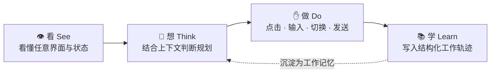

<a name="readme-top"></a>

<div align="center">

<h1>SightFlow · 开源工作记忆引擎</h1>

<p><strong>让 AI 进入真实软件世界 —— 看懂界面，完成任务，沉淀岗位经验。</strong></p>

<p>
  <a href="./README.md">English</a>
  &nbsp;·&nbsp;
  <a href="./README.zh-CN.md"><b>简体中文</b></a>
</p>

<p>
  <a href="LICENSE"></a>
  <a href="https://github.com/sightflow-dev/sightflow-desktop-agent/stargazers"></a>
  <a href="https://github.com/sightflow-dev/sightflow-desktop-agent/network/members"></a>
  
  <a href="https://discord.com/invite/8H6KpbXq3t"></a>
  <a href="https://sightflow.dev"></a>
</p>

<p>
  <a href="#-快速开始"><b>快速开始</b></a> ·
  <a href="#-工作原理--看--想--做--学"><b>工作原理</b></a> ·
  <a href="#-配置说明"><b>配置说明</b></a> ·
  <a href="https://sightflow.dev"><b>官网</b></a>
</p>

</div>

---

## 项目概述

> **SightFlow 不替代 LLM，而是补齐 LLM 无法进入软件世界的关键一层** —— 把屏幕像素解析成结构化语义，再把任务意图转成真实操作。

<div align="center">
  <video src="./docs/videos/sightflow_demo.mp4" width="100%" controls></video>
</div>

企业最重的工作，不在大模型 API 接口里，而**在屏幕上、在人类工作流中**：

- **界面多** —— 一个任务横跨多个软件、多个窗口。
- **流程长** —— 看消息 → 判断 → 执行 → 跟进 → 兜底，不是点一次按钮。
- **经验隐性** —— 真正的业务经验在老员工每一次判断里，不在文档里。

大模型解决了「想」和「说」，还没解决「学会」和「做好」。SightFlow 正是补齐这一层的桌面运行时 —— 一个能**看懂**任意界面、结合上下文**判断**、像真人一样**执行**、并从每一次操作中**沉淀**经验的 Agent。

---

## ✦ 工作原理 · 看 · 想 · 做 · 学



| 阶段 | 做什么 |
| :-- | :-- |
| **See · 看懂 GUI** | 视觉模型理解任意软件界面与状态。 |
| **Think · 判断规划** | 结合上下文与历史，决定该做什么。 |
| **Do · 完成操作** | 点击、输入、切换窗口、发送、记录 —— 像真人操作员一样。 |
| **Learn · 沉淀轨迹** | 每次执行写入结构化**工作轨迹（work-trace）**，沉淀为可复用的工作记忆。 |

> 这不是一个应用，而是一套让 AI 上岗的**「工作记忆引擎」**。

---

## ✦ 技术框架 · 工作记忆引擎（Work Memory Runtime）

每一次执行 = 一条结构化轨迹 **`work-trace`**：

```text
work-trace = {
  timestamp,    # 时间戳
  ui_state,     # 界面状态
  rationale,    # 判断依据（为什么这么做）
  action,       # 点击 / 输入 / 切换 / 发送
  result        # 结果
}
```

持续写入、可逐条回放。由此带来**普通 RPA 做不到的三个能力**：

| 能力 | 为什么重要 |
| :-- | :-- |
| 🔁 **可回放 Replay** | 出问题时，能复盘到每一步 —— 乃至背后的判断依据。 |
| 📊 **可评测 Eval** | 换模型 / 换版本，执行效果可一致地对比。 |
| 🧬 **可继承 Inherit** | 任务背后的判断被沉淀一次、反复复用，而不只留在某个人脑子里。 |

> 别人记录的是**操作步骤**，我们记录的是**「为什么这么做」**。这正是从 **RPA** 到 **Agent Runtime** 的关键差别。

面向真实、敏感环境而设计：

- 🔒 **本地执行** —— 工作轨迹默认留在本机，数据无需出企业。
- 🧾 **全程可审计** —— 每一条执行轨迹都可逐条审查。
- 🔄 **多模型可切换** —— 适配视觉大模型，可在多家 Provider 间切换。

---

## ✦ 核心能力

从微信、企业微信到**任意桌面软件**，SightFlow 让 AI 在**没有 API** 的地方也能工作。

- **通用视觉驱动自动化** —— 抛弃脆弱的 Webhook 与私有协议，像真实人类用户一样阅读气泡、操作输入框、浏览原生 UI 界面。
- **前沿的视觉模型引擎** —— 由统一视觉层驱动，在复杂动态的布局中实时提取红点角标、消息列表、聊天气泡中的文本与语义信息。
- **智能体工作流工作区** —— 将非结构化的聊天请求瞬间转化为可执行的节点工作流与 API 调用，通过本地 AI 实现全维度可编程化。

---

## 🚀 快速开始

SightFlow 桌面端是基于 **Electron · electron-vite · React · TypeScript** 构建的跨平台客户端，由视觉语言模型（VLM）驱动。

**环境要求：** Node.js（LTS）与 npm。

### 1. 安装依赖

```bash
npm install
```

### 2. 本地开发运行

```bash
npm run dev
```

> 启动后，请先选择**目标应用**并完成必要的框选，再进入**设置**窗口填写 API Key、确认当前启用的 Provider。

### 3. 打包构建

```bash
npm run build:win     # Windows
npm run build:mac     # macOS
npm run build:linux   # Linux
```

---

## ⚙️ 配置说明

桌面端的配置分为两层：

- **基础配置** —— 填写火山方舟 API Key，用于视觉定位、内置豆包智能体等基础能力。
- **智能体 / Provider** —— 选择负责聊天分析和内容生成的 Provider，并维护各自配置。

### SK Key 的用途

1. **智能对话回复** —— 由于项目涉及类似微信等的自动抓取，模型会分析聊天界面的截图并生成自然的回复内容（带防止自我循环对话机制）。
2. **VLM 视觉定位引导** —— 基于屏幕截图和特定 Prompt，让模型自动检测屏幕上的 UI 控件，并返回需要点击的坐标，从而驱动纯视觉的 RPA 流程。

### 如何配置

1. 前往 [火山引擎控制台 · 方舟原生接口](https://console.volcengine.com/ark) 开通相关服务，并生成 / 获取你的 API Key。
2. 启动项目后点击主界面右下角的设置按钮，打开独立设置窗口。
3. 在 **基础配置** 中填写 API Key。默认 Base URL 为 `https://ark.cn-beijing.volces.com/api/v3`，通常无需修改。
4. 在 **智能体** 中选择当前使用的 Provider。内置默认智能体为 **豆包 Seed**，模型固定为 `doubao-seed-2-0-lite-260428`。

### 界面预览

| 主界面 | 基础配置 | 智能体配置 |
| :--: | :--: | :--: |
|  |  |  |

### 目标应用与框选模式

主界面提供 **目标应用** 快捷配置，用来决定桌面端如何测量聊天窗口布局：

- **微信、企业微信** 默认使用 VLM 自动识别窗口区域。
- **钉钉、飞书、Slack、Telegram** 及其他桌面应用默认使用 **手动框选**。
- 当目标应用需要框选时，点击 **开始框选**，依次圈出 **会话列表、聊天内容区、输入框** 3 个区域。
- 框选结果会按目标应用保存到本地；后续启动会复用已保存区域，也可以随时重新框选。

> VLM 和框选模式只影响「如何测量布局」。运行时截图、内容分析、生成回复和发送消息会消费同一套布局结果。

### 智能体 / Provider Hub

SightFlow 桌面端把「截图分析并生成回复」的聊天能力抽象为独立 **Provider**。Provider 通过 `manifest.json` 声明配置结构，通过 bundle 入口接收聊天截图并返回 `reply_text`、`skip`、`error` 等事件。

- 默认从 `https://sightflow.dev/provider-hub.json` 拉取候选 Provider 列表。
- Hub 只维护 Provider 的 `manifestUrl`，UI 展示字段来自各 Provider 的 manifest。
- 首次加载后会缓存到本地；除非手动点击智能体标题旁的刷新按钮，否则优先使用本地缓存。
- 本地始终保留内置 **豆包 Seed** 作为默认 Provider，避免远端列表不可用时没有可选项。

外部 Provider 接入说明见：[聊天 Provider 接入文档](./docs/provider.md)。仓库内仍保留一个 Doubao / 火山方舟 Provider 示例，供接入文档和本地开发参考：

```text
resources/providers/volcengine-ark/manifest.json
resources/providers/volcengine-ark/provider.bundle.js
```

> **开发环境推荐配置：** [VS Code](https://code.visualstudio.com/) + [ESLint](https://marketplace.visualstudio.com/items?itemName=dbaeumer.vscode-eslint) + [Prettier](https://marketplace.visualstudio.com/items?itemName=esbenp.prettier-vscode)。

---

## 🔐 安全与数据归属

SightFlow 的执行轨迹（work-trace）**默认保存在本地** —— 不会上传到任何服务器，也不会进入任何公共训练数据集。代码开源不代表用户数据开源：**你的工作数据始终属于你。**

---

## 🤝 共建与社区

我们相信 **Agent Computer Use 会是未来 10 年重要 AI 革命的基建**。如果你也希望参与到这个项目的迭代，欢迎加入我们。

- 💬 **[加入 Discord](https://discord.com/invite/8H6KpbXq3t)** —— 与社区一起共建。
- ⭐ **[给项目点个 Star](https://github.com/sightflow-dev/sightflow-desktop-agent)** —— 这对我们真的很有帮助。
- 🛠 **参与贡献** —— 欢迎提交 Issue 与 Pull Request。

---

## 📄 开源协议

本项目采用 [Apache License 2.0](LICENSE) 开源协议。

---

## 📬 联系我们

- 🌐 **官网：** [sightflow.dev](https://sightflow.dev)
- ✉️ **邮箱：** [builder@sightflow.dev](mailto:builder@sightflow.dev)
- 💬 **Discord：** [加入社区](https://discord.com/invite/8H6KpbXq3t)

<div align="center"><sub>© 2026 SightFlow. 基于 Apache License 2.0 开源。</sub></div>

<p align="right"><a href="#readme-top">↑ 返回顶部</a></p>
